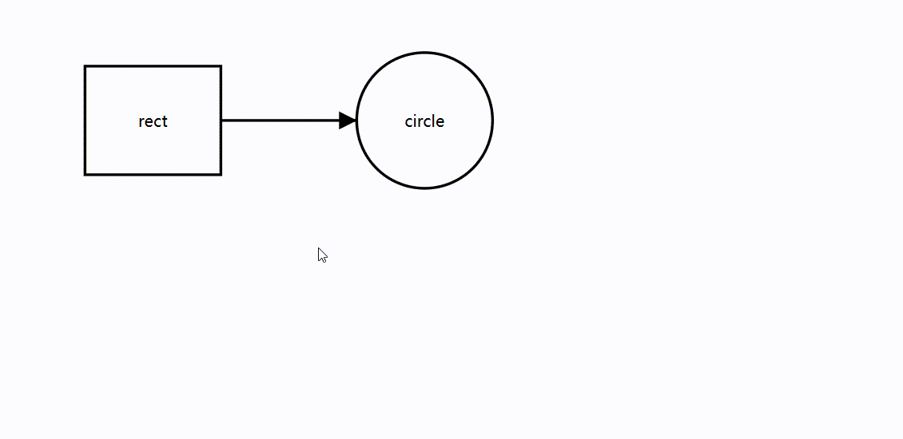

# LOGICFLOW-PLUGIN-GLOBAL-DRAG

这是一个 [LogicFlow](https://github.com/didi/LogicFlow) 插件，用于实现全局拖拽功能。

LogicFlow 默认只能通过点击画布空白区域来拖拽画布，该插件可以让用户在按住 `空格键` 的同时，点击画布任意区域来拖拽画布。



## How to use

```bash
npm i -D logicflow-plugin-global-drag
```

```javascript
import LogicFlow from '@logicflow/core';
import GlobalDrag from 'logicflow-plugin-global-drag';

const lf = new LogicFlow({
  // ...
  plugins: [GlobalDrag],
  // 确保开启了键盘快捷键功能
  keyboard: {
    enabled: true,
  },
});
```

⚠ 注意：请确保开启了键盘快捷键功能，否则无法使用全局拖拽功能。

## License

MIT
